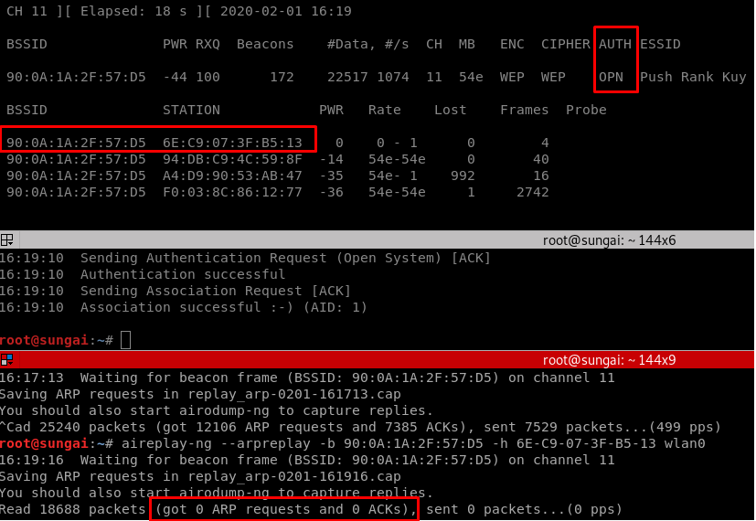
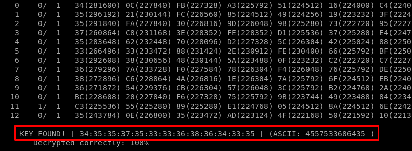

# PRE CONNECTION  

## SNIFFING 
untuk melakukan ini anda bahkan tidak perlu terhubung ke wifi. 

### SNIFFING TO 5GHz FREQUENCY
```
airodump-ng --band a wlan0  
```

### SNIFFING TO ALL FREQUENCY
```
airodump-ng --band abg wlan0
```

### SNIFFING FOR SPESIFIC TARGET
```
airodump-ng --bssid mac --channel channelberapa --write namafile wlan0
```

## GATHER INFORMATION
dari hasil snifing di atas maka akan terbentuk file dengan ekstensi .cap. Buka file tersebut dengan wireshark, maka akan terlihat info mengenai seluruh trafik misalnya info device yang digunakan, bahkan passwod dan username. namun kita perlu memperhatikan ENC yang digunakan , jika wifi tersebut menggunakan enc seperti WEP/WPA/WPA2 maka yang tampil di wireshark hanya informasi terenkrip yang tidak bisa kita baca, namun jika ENC nya OPN kita bisa mengintip password nya karena semua nya plain text. 

## DEAUTH ATTACH
kita akan pura pura menjadi client untuk mengirim request deauth ke router, dan sekaligus menjadi router untuk mereply request tersebut ke client

```
aireplay-ng --deauth 10000000 -a mactargetrouter -c mactargetpc wlan0
```
10000000 menentukan berapa banyak paket deauth yang akan dibuat, semakin banyak maka semakin lama target terputus dari jaringan. 

## HOW WEP WORKS
Enkripsi WEP masih digunakan walau sudah sangat jarang. WEP menggunakan algoritma RC4 untuk mengenkrip data. jika client mau kirim data ke router, data akan di enkrip menggunakan key. maka data berubah menjadi gibberish, gibberish kemudian dikirim ke AP, AP akan menerima dan bisa membuka nya karena AP punya key nya. begitu sebaliknya jika AP mau kirim ke client, konsep nya sama. MITM mungkin bisa mensnif semua data yang dikirim, tapi semua terenkrip.  

tidak ada masalah pada algoritma RC4, masalah nya adalah bagaimana WEP mengimplementasikan nya. 

mari kita jabarkan agak detail, client mau kirim data ke router. setiap paket akan dibuatkan uniques key stream oleh WEP, caranya dengan menghasilkan 24bit random initializaton vector, IV akan di tambahkan dengan Key/password (yang digunakan untuk connect ke network) hasilnya adalah keystream. keystream ini digunakan untuk mengencrypt packet menjadi gibberish.
kemudian giberish dan IV(dalam bentuk plain text) dikirim ke router. kenapa IV nya harus diikutkan ? karena agar si router bisa menggenerate keystream untuk mendecrypt gibberish nya. Dan jeleknya IV akan di repeat in busy network, ini membuat WEP vulnerable for statistical attack, Dengan Repeated IV, keystream bisa ditemukan dan akhirnya passwordnya juga bisa ditentukan. 

## CRACK WEP
### CRACK WEP IN BUSY NETWORK
untuk crack WEP kita perlu menangkap IV dalam **jumlah banyak**, menggunakan airodump-ng. dan menganalyse IV sekaligus menjalankan statistical attack dan crack key nya menggunakan menggunakan aircrack-ng. **Ingat Data yang di Capture harus dalam jumlah yang banyak**


```
airodump-ng --bssid mactargetrouter --channel channelberapa --write namafile wlan0 
```

```
aircrack-ng namafile.cap 
```

in some cases kita hanya akan dapat key berformat `nn:nn:nn:nn:nn`, untuk menggunakannya hapus semua tanda `:`. Atau biasanya kita juga bisa mendapat ASCII password yang bisa langung digunakan. 

### CRACK WEP IN NOT BUSY NETWORK
pada network yang sepi, penambahan jumlah data akan sangat lambat, sehingga kita harus menunggu cukup lama.


solusi nya adalah memaksa AP untuk menggenerate IV baru. kita perlu *mengasosiasikan* adapter kita dengan network target, adpater perlu memberi tahu bahwa adapter mau berkomunikasi dengan AP. karena secara default AP akan menolak semua komunikasi keculai device yang mau berkomunikasi sudah terhubung/connected. *ingat : associate ga perlu password, kalau mau connect kita perlu password*.


#### STEP 1
capture dulu
```
airodump-ng --bssied mactargetrouter --channel channelberapa --write namafile wlan0
```
#### STEP 2
asosiasikan adapter ke network target
```
aireplay-ng --fakeauth 0 -a mactargetrouter -h macadapterkita wlan0
```
command di atas adalah fake auth digunakan untuk meng open auth, sehingga komunikasi kita akan terus diterima. sedangkan 0 artinya kita lakukan ini cuma sekali.

#### STEP 3
gunakan arp request reply, idenya adalah dengan menunggu paket ARP, capture it dan mereply(retransmit it). sehingga menyebabkan AP menggenerate paket baru dengan new IV. dengan keep doing this kita akan mendapatkan new paket dan new iv terus menerus, sehingga ketika data nya sudah cukup kita bisa crack the key.
```
aireplay-ng --arpreplay -b mactargetrouter -h macadapterkita wlan0
```

dari yang sudah dicoba, ternyata butuh waktu lama untuk mendapat paket arp, kita perlu menunggu orang ganti ip dulu biar ada paket ARP atau orang konek baru. 
 

#### STEP 4
ketika capture nya dirasa sudah cukup, kita bisa menjalankan aircrack-ng
```
aircrack-ng namafile.cap
```

#### RESULTS

yey KEYFOUND...


