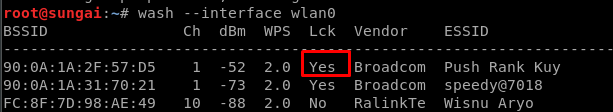

# PRE CONNECTION(2)
WPA dan WPA2 itu sama, bedanya cuma ada di enkripsi nya aja. WPA menggunakan TKIP dan WPA2 menggunakan CCMP. sehingga cara cracking nya sama dan bisa digunakan untuk keduanya. keduanya lebih secure dari WEP

## WPS
WPS adalah fitur yang biasanya ada ketika kita menggunakan WPA dan WPA2. WPS ini sebenarnya ngga ada hubungan nya sama enkripsi yang digunakan WPA dan WPA2. dengan WPA client ga perlu masukin key untuk connect ke AP. cukup pencet tombol wps button aja. ketika WPS button di pencet klien sebenarnya akan memasukkan 8 digit pin untuk melakukan autentikasi. 

## WPS ATTACK
ingat ya.. metode ini bukan mengeksploitasi WPA dan WPA2, tapi mengeksploitasi fitur WPS yang biasanya aktif di WPA dan WPA2. Syarat nya WPS harus aktif dan menggunakan normal pin authentication dan bukan PBC push button authentication. (kecuali emg WPS nya emg di pencet physically in purpuse, tapi kan ngga mungkin).
Di router router baru secara default metode PBC yang akan aktif atau bahkan WPS nya ngga aktif. sehingga metode ini bisa aja gagal, tapi seenggaknya kita udah coba, sapa tau berhasil kan. 

### STEP 1
scan network mana aja yang wps nya aktif

```
wash --interface wlan0
```


Jika bagian Lck atau Lock bernilai `yes` berarti WPS akan terlock setelah beberapa kali failed attemps. artinya kita tidak bisa menggunakan metode ini. Jika bernilai `No`, Maka kita bisa melanjutkan metode ini. 

### STEP 2
jalankan reaver yang akan membruteforce pin, yang akan digunakan untuk mengcompute actual WPA key. 
```
./reaver --bssid macaddresstargetrouter --channel channelberapa --interface wlan0 -vvv --no-associate
```
`--no-associate` akan mencegah router mengasosiasikan ke target secara otomatis, karena tugas ini akan kita lakukan manual di step 3. 

### STEP 3
asosiasikan adapter kita dengan target
```
aireplay-ng --fakeauth 30 -a mactargetrouter -h macadapterkita wlan0
```
artinya kita akan mengasosiasikan adapter kita ke target setiap 30 detik. 
 
### RESULT
dan ternyata setelah dicoba WPS ter lock sebelum berhasil mendapatkan pin wps nya. 


percobaan berikutnya malah timeout mulu.

belum berhasil guys. coba lagi nanti ya. (V24)

## CRACKING WPA/WPA2

### STEP 1 CAPTURING WPA/WPA2 HANDSHAKE 
Dalam WPA dan WPA2 data yang kita capture ngga mengandung informasi yang berguna, satu satunya yang berguna adalah paket handshake, ini adalah 4 paket yang di transfer antara client ke AP ketika client pertama kali connect ke AP. caranya sama kaya capture data sebelumnya.

```
airdump-ng --bssid macaddressrouter --channel channelberapa --write namafile wlan0
```

kemudian supaya dapat paket handshake, kita bisa gunakan deauth, untuk memaksa salah satu client target melakukan handshaking.

```
aireplay-ng --deauth 10 -a macaddressrouter -c macaddressclienttarget wlan0
```


kalau berhasil maka akan ada kayak gini


### STEP 2 CREATING WORDLIST
wordlist akan digunakan untuk ditambahkan dengan parameter lain untuk membentuk semacam hash yang nanti dicocokan dengan hash yang ada di file capture handshake yang sudah kita dapat.

```
crunch [min] [max] [characters] -t [pattern] -o [namafile]
```
```
crunch 6 8 123abc% -o wordlist.txt -t a@@@@b 
```
a@@@@b maksudnya password di awali huruf a diakhiri huruf b, ditengah tengah nya pake karakter yang ada di 123abc%.

### STEP 3 AIRCRACK-NG
AIRCRACK-NG akan mengekstrak informasi dari paket handshake yang kita dapatkan, pertama MIC atau message integrity code akan di ambil, kemudian terdapat beberapa informasi lain seperti SP Address, STA Address, AP Nonce, STA Nonce EAPOL, Payload akan di kombinasikan dengan tiap baris wordlist yang kita punya satu persatu,  kemudian MIC yang di hasilkan akan dibandingkan dengan MIC yang ada di paket handshake. 

```
aircrack-ng namafile.cap -w wordlist.txt 
```
### RESULT
jadi tingkat keberhasilan attack ini tergantung gimana kita membuat wordlist kita. 


